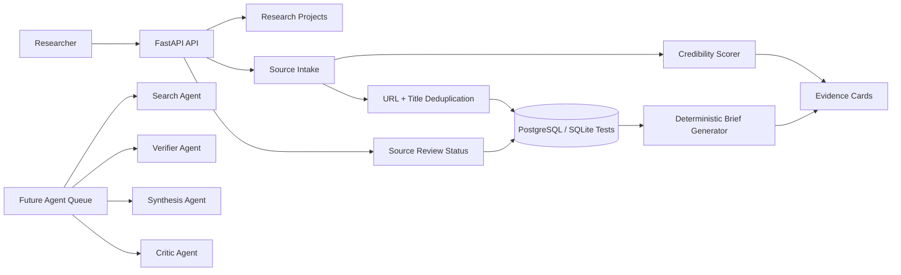

# Multi-Agent Research Workspace

AI-ready research workspace for collecting sources, reviewing evidence quality, and generating cited preliminary briefs. It gives researchers a structured place to move from scattered links and notes into auditable evidence cards.

This project is built as an engineering portfolio piece for AI product, research tooling, and multi-agent workflow roles. It demonstrates the backend foundation for search, verification, synthesis, critique, and citation agents before connecting external search or paid model APIs.

## Why This Exists

Research workflows often collapse into browser tabs, pasted notes, and summaries that are hard to verify later. A useful AI research system needs provenance, source review, credibility signals, evidence gaps, and reproducible synthesis before it can responsibly automate the research loop.

This repo focuses on that foundation:

- research project creation around a concrete question
- source intake with provenance and key claims
- per-project deduplication by normalized URL or title
- source review statuses for candidate, verified, rejected, and needs-review material
- deterministic credibility scoring with transparent reasons
- cited preliminary briefs generated from usable evidence
- database-backed persistence with CI-friendly local tests

## Architecture



The current implementation keeps search and synthesis deterministic so local development and CI do not depend on external services. PostgreSQL is the intended development and production storage path, while tests run against SQLite-backed sessions.

## What Reviewers Should Notice

- FastAPI service with narrow request/response contracts.
- SQLAlchemy models for research projects and sources.
- Alembic migrations for schema evolution.
- Source deduplication by normalized URL and normalized title within a project.
- Review workflow that keeps rejected sources for audit history while excluding them from generated evidence.
- Deterministic credibility scoring with explicit reason strings.
- Brief generation that prefers verified sources and reports gaps when evidence is weak or unverified.
- Tests covering API behavior, persistence, deduplication, credibility scoring, and brief generation.
- Documentation that separates implemented behavior from planned multi-agent orchestration.

## Features

- `GET /health` returns service status and environment.
- `POST /research/projects` creates a research project from a question.
- `POST /research/projects/{project_id}/sources` adds or deduplicates a source and returns credibility assessment.
- `PATCH /research/projects/{project_id}/sources/{source_id}/review` updates source status and reviewer notes.
- `GET /research/projects/{project_id}/brief` generates a deterministic cited preliminary brief.
- Docker Compose includes PostgreSQL and Redis for the persistent and queued workflow path.
- GitHub Actions runs Ruff and pytest.

## Tech Stack

- Python 3.12
- FastAPI
- Pydantic Settings
- SQLAlchemy
- Alembic
- PostgreSQL
- SQLite for deterministic tests
- pytest
- Ruff
- Redis planned
- Optional search and LLM providers planned

## Repository Tour

```text
app/api/             FastAPI routers for health and research workflows
app/db/              SQLAlchemy models, sessions, and persistence setup
app/research/        Domain models, source store, credibility scoring, and brief generation
alembic/             Database migrations
docs/                System design and production tradeoffs
tests/               Unit and API tests
docker-compose.yml   Local PostgreSQL and Redis services
```

## Local Setup

Create an environment file:

```bash
cp .env.example .env
```

Install dependencies:

```bash
python3 -m venv .venv
source .venv/bin/activate
pip install -e ".[dev]"
```

Start local infrastructure once Docker is available:

```bash
docker compose up -d
```

Run migrations:

```bash
alembic upgrade head
```

Start the API:

```bash
uvicorn app.main:app --reload
```

The API runs on `http://localhost:8000` by default.

Health check:

```bash
curl http://localhost:8000/health
```

Local tests use SQLite, so Docker is not required for validation.

## Demo Flow

Create a project:

```bash
curl -X POST http://localhost:8000/research/projects \
  -H "Content-Type: application/json" \
  -d '{"question":"What makes multi-agent research workflows reliable?"}'
```

Add a source:

```bash
curl -X POST http://localhost:8000/research/projects/{project_id}/sources \
  -H "Content-Type: application/json" \
  -d '{
    "title": "Research workflow guidance",
    "url": "https://example.gov/research-guidance",
    "source_type": "government",
    "author": "Research Office",
    "published_at": "2026-01-01T00:00:00Z",
    "summary": "Guidance on auditable research workflows.",
    "key_claims": [
      "Reliable research workflows track evidence provenance.",
      "Credibility scoring helps reviewers compare sources."
    ]
  }'
```

Submitting the same normalized URL or title again returns the existing source ID with `created: false`.

Review the source:

```bash
curl -X PATCH http://localhost:8000/research/projects/{project_id}/sources/{source_id}/review \
  -H "Content-Type: application/json" \
  -d '{
    "status": "verified",
    "review_note": "Relevant source with clear provenance."
  }'
```

Generate a preliminary brief:

```bash
curl http://localhost:8000/research/projects/{project_id}/brief
```

The brief includes answer text, evidence cards, average credibility, and research gaps. Rejected sources stay stored for traceability but do not appear in generated evidence.

## Environment Variables

| Variable | Purpose | Example |
| --- | --- | --- |
| `APP_ENV` | Runtime environment label | `local` |
| `LOG_LEVEL` | Logging verbosity | `INFO` |
| `DATABASE_URL` | SQLAlchemy database URL | `postgresql+psycopg://...` |
| `REDIS_URL` | Redis connection string for future queue/cache work | `redis://localhost:6382/0` |
| `LLM_PROVIDER` | Reserved synthesis provider selector | `mock` |

## Testing

```bash
pytest
ruff check .
```

The test suite validates the core workflow without paid model APIs or a running PostgreSQL instance.

## Design Notes

More detail is available in [docs/system-design.md](docs/system-design.md).

Key tradeoffs:

- Deterministic scoring is less nuanced than human or LLM review, but it makes source ranking reproducible and easy to test.
- SQLite-backed tests keep CI simple; PostgreSQL remains the target runtime database.
- Brief generation currently uses stored claims instead of open-ended LLM prose, which prevents unsupported synthesis while the evidence model matures.
- Rejected sources are retained for auditability, but excluded from generated evidence to avoid contaminating drafts.
- Multi-agent orchestration is deferred until source intake, review, and evidence generation are stable.

## Future Improvements

- Add search provider connectors for source discovery.
- Add async agent runs for search, verification, synthesis, critique, and citation formatting.
- Add LLM synthesis constrained to evidence cards.
- Add a frontend research board for reviewing sources and evidence gaps.
- Add Markdown/PDF export with citations.
- Add authentication and workspace-level access controls.
