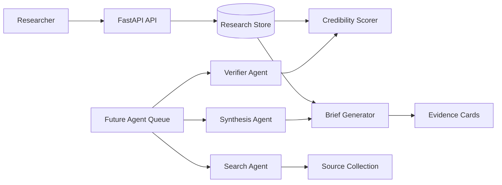

# Multi-Agent Research Workspace

Multi-Agent Research Workspace is an AI-ready research application for creating research questions, collecting sources, scoring source credibility, and generating cited preliminary briefs.

The first implementation is deterministic and local. It does not call search engines or paid model APIs yet; instead, it establishes the core product workflow and domain boundaries that future researcher, verifier, synthesizer, and citation agents can use.

## Problem Statement

Research workflows often collapse into scattered tabs, notes, and uncited summaries. A useful AI research workspace needs source provenance, credibility signals, explicit evidence, and gap tracking before it can responsibly synthesize conclusions. This project demonstrates that workflow in a testable, extensible service.

## Architecture



## Features

- FastAPI backend scaffold
- Health endpoint
- Research project creation
- Source collection with title, URL, type, author, publication date, summary, and key claims
- SQLAlchemy persistence models and Alembic migration for projects and sources
- Per-project source deduplication by normalized URL or normalized title
- Deterministic credibility scoring
- Evidence cards with source references and scores
- Cited preliminary brief generation
- Research gap detection
- Docker Compose for PostgreSQL and Redis
- GitHub Actions CI for Ruff and pytest
- System design documentation with agent workflow, reliability, and safety notes

## Tech Stack

- Python 3.12
- FastAPI
- Pydantic Settings
- SQLAlchemy
- Alembic
- pytest
- Ruff
- PostgreSQL
- Redis planned
- Optional LLM/search providers planned

## Local Setup

```bash
cp .env.example .env
python3 -m venv .venv
source .venv/bin/activate
pip install -e ".[dev]"
uvicorn app.main:app --reload
```

The API runs on `http://localhost:8000` by default.

Start local infrastructure once Docker is available:

```bash
docker compose up -d
```

Run migrations after PostgreSQL is available:

```bash
alembic upgrade head
```

Local tests use SQLite so Docker is not required for validation.

## Environment Variables

| Variable | Purpose | Example |
| --- | --- | --- |
| `APP_ENV` | Runtime environment label | `local` |
| `LOG_LEVEL` | Logging verbosity | `INFO` |
| `RESEARCH_STORE` | Research store selector | `memory` |
| `LLM_PROVIDER` | Future synthesis provider selector | `mock` |
| `DATABASE_URL` | PostgreSQL connection string | `postgresql+psycopg://...` |
| `REDIS_URL` | Redis connection string | `redis://localhost:6382/0` |

## API Examples

```bash
curl http://localhost:8000/health
```

```bash
curl -X POST http://localhost:8000/research/projects \
  -H "Content-Type: application/json" \
  -d '{"question":"What makes multi-agent research workflows reliable?"}'
```

```bash
curl -X POST http://localhost:8000/research/projects/{project_id}/sources \
  -H "Content-Type: application/json" \
  -d '{
    "title": "Research workflow guidance",
    "url": "https://example.gov/research-guidance",
    "source_type": "government",
    "author": "Research Office",
    "published_at": "2026-01-01T00:00:00Z",
    "summary": "Guidance on auditable research workflows.",
    "key_claims": [
      "Reliable research workflows track evidence provenance.",
      "Credibility scoring helps reviewers compare sources."
    ]
  }'
```

```bash
curl http://localhost:8000/research/projects/{project_id}/brief
```

## Testing

```bash
ruff check .
pytest
```

## Persistence And Deduplication

Research projects and sources are stored through SQLAlchemy models. The first migration creates `research_projects` and `research_sources` with uniqueness constraints for each project's normalized source URL and normalized source title.

When a duplicate source is submitted, the API returns the existing source ID with `created: false` instead of creating a second record. URL normalization lowercases the host, removes fragments, trims trailing slashes, sorts query parameters, and ignores `utm_*` tracking parameters.

## Future Agent Roles

- **Search Agent:** finds candidate sources for a research question.
- **Verifier Agent:** checks source freshness, type, author, and claim support.
- **Synthesis Agent:** drafts concise answers from evidence cards.
- **Critic Agent:** identifies weak evidence, missing perspectives, and overclaims.
- **Citation Agent:** formats final citation bundles and source maps.

## Reliability Considerations

- Briefs should remain reproducible from stored sources and claims.
- Duplicate submissions should return the existing source instead of creating conflicting evidence.
- Agent-generated conclusions should cite evidence cards.
- Missing publication dates and weak source types should surface as research gaps.
- Future search/model failures should not corrupt saved source records.
- Source deduplication should use URL and normalized title.

## Security And Safety

- No secrets are committed; use `.env` locally and managed secrets in CI or hosting.
- User-uploaded notes or documents should be treated as private by default.
- Future web search connectors should store fetched source metadata and access timestamps.
- LLM synthesis should avoid unsupported claims and expose evidence gaps.
- Research outputs should be labeled as preliminary unless reviewed by a human.

## Future Improvements

- Project-level source status
- Search provider abstraction
- Async agent queue for search, verification, synthesis, critique, and citations
- LLM synthesis constrained to evidence cards
- Frontend research board
- Export to Markdown/PDF with citations
